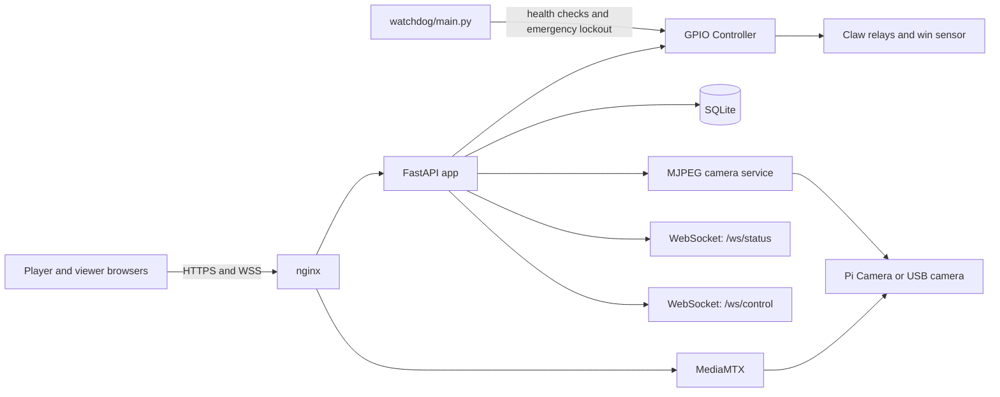
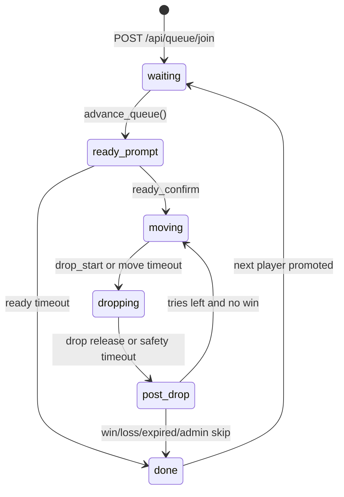

# Remote Claw

Remote Claw is a FastAPI + WebSocket control server for a physical claw machine.

It provides:
- Queue-based turn management.
- Real-time control over GPIO relays.
- Browser clients for players and spectators.
- WebRTC streaming via MediaMTX with MJPEG fallback.
- Admin APIs and admin panel for operations.
- Safety mechanisms (watchdog, forced relay shutdown, state recovery).

## Current Architecture



## Repository Layout

```text
app/
  api/                 Public/admin REST APIs + stream proxy
  game/                Queue manager and state machine
  gpio/                Real and mock GPIO abstraction
  ws/                  Status and control WebSocket handlers
  main.py              App bootstrap + startup/shutdown lifecycle
web/                   Player UI, embed UI, admin UI
watchdog/              Independent hardware safety process
deploy/                systemd, nginx, MediaMTX configs
migrations/            SQLite schema migrations
docs/                  Operational and integration documentation
tests/                 Pytest coverage for API, state machine, reliability
```

## Runtime Model

- Single-process uvicorn worker is required.
- State machine is authoritative for live turn state and timers.
- SQLite is authoritative for queue entries, game history, contacts, and rate limits.
- WebSocket channels:
  - `/ws/status`: broadcast stream for all connected viewers.
  - `/ws/control`: authenticated per-player control channel.

## Core Game Flow



## Primary Endpoints

### Public API

| Method | Path | Purpose |
|---|---|---|
| POST | `/api/queue/join` | Join queue and receive bearer token |
| DELETE | `/api/queue/leave` | Leave queue (works for waiting, ready, or active player) |
| GET | `/api/queue/status` | Current player + queue length |
| GET | `/api/queue` | Queue list snapshot |
| GET | `/api/session/me` | Session state for bearer token |
| GET | `/api/history` | Recent game outcomes |
| GET | `/api/health` | Service health / runtime status |
| GET | `/api/stream/snapshot` | JPEG snapshot from built-in camera |
| GET | `/api/stream/mjpeg` | MJPEG fallback stream |

### Admin API (`X-Admin-Key`)

| Method | Path | Purpose |
|---|---|---|
| POST | `/admin/advance` | End current turn |
| POST | `/admin/emergency-stop` | Hard lock GPIO outputs |
| POST | `/admin/unlock` | Unlock GPIO after emergency stop |
| POST | `/admin/pause` | Pause queue advancement |
| POST | `/admin/resume` | Resume queue advancement |
| GET | `/admin/dashboard` | Operational summary + queue/results |
| GET/PUT | `/admin/config` | View/update runtime configuration |
| POST | `/admin/kick/{entry_id}` | Remove queue entry |
| GET | `/admin/queue-details` | Queue entries including IDs |
| GET | `/admin/contacts/csv` | Export contact list |
| GET | `/admin/wled/test` | Validate WLED connectivity |
| POST | `/admin/wled/preset/{preset_id}` | Trigger WLED preset |
| POST | `/admin/wled/on` | Turn WLED on |
| POST | `/admin/wled/off` | Turn WLED off |

## Local Development

```bash
./install.sh dev
make run
```

Open `http://localhost:8000`.

Useful commands:

```bash
make test
make test-quick
make simulate
make status
```

## Raspberry Pi Deployment

```bash
./install.sh pi
```

For short demo timings:

```bash
./install.sh demo
```

The installer sets up:
- Python virtual environment + dependencies.
- MediaMTX service.
- nginx reverse proxy config.
- `claw-server` and `claw-watchdog` systemd services.

## Documentation Index

- [QUICKSTART.md](QUICKSTART.md): setup and operations guide.
- [docs/queue-flow.md](docs/queue-flow.md): protocol and state-flow reference.
- [docs/wordpress-embed.md](docs/wordpress-embed.md): embed and WordPress integration.
- [docs/video-stream-ssl-fix.md](docs/video-stream-ssl-fix.md): reverse-proxy streaming troubleshooting.
- [docs/brownrice-ssl-proxy.md](docs/brownrice-ssl-proxy.md): TLS front-door architecture.
