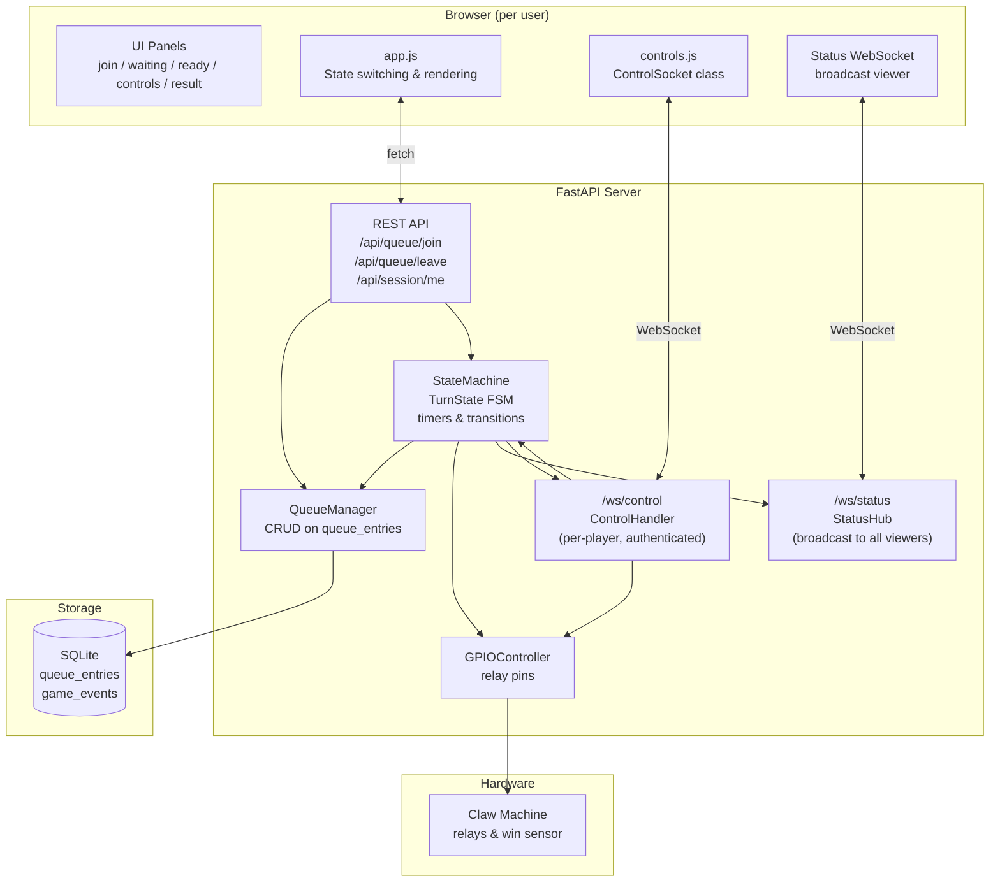
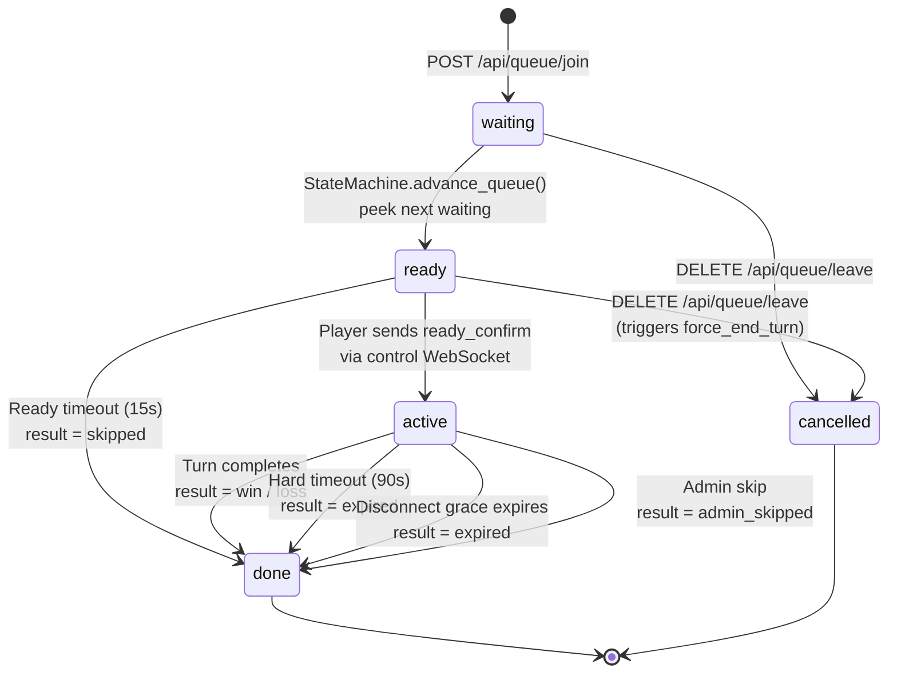
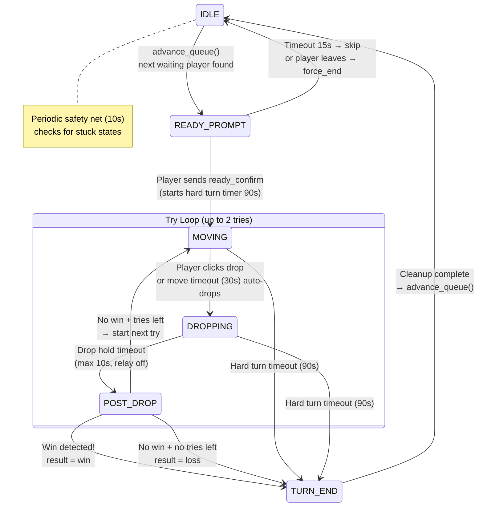
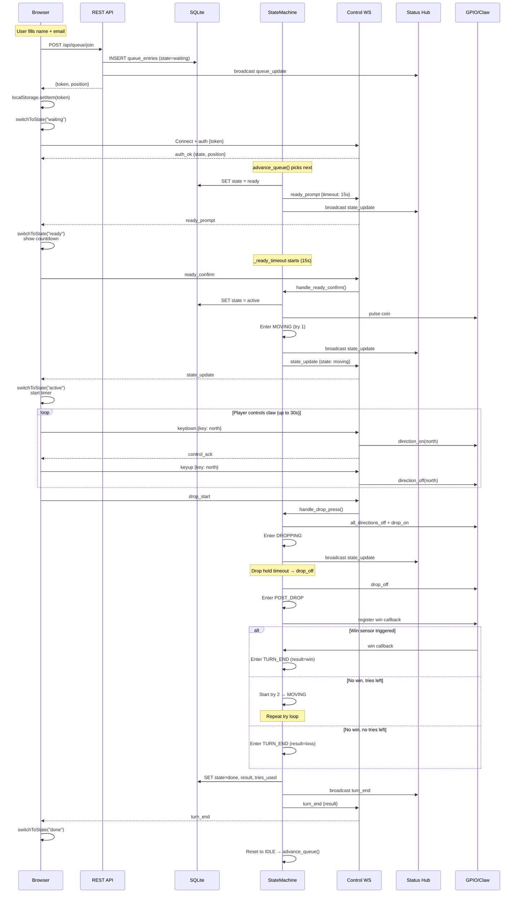
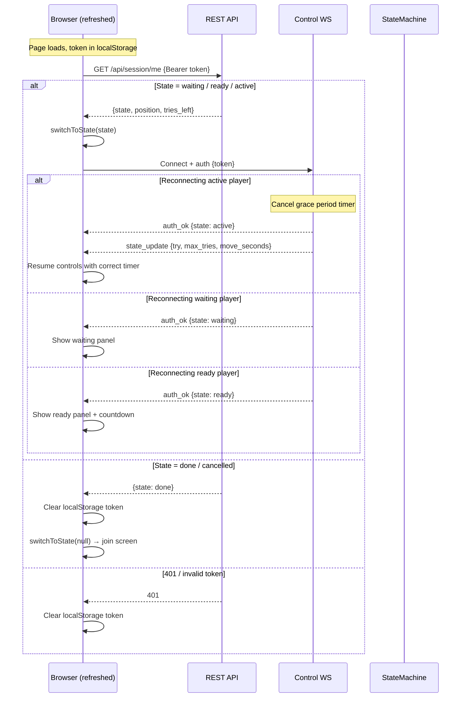
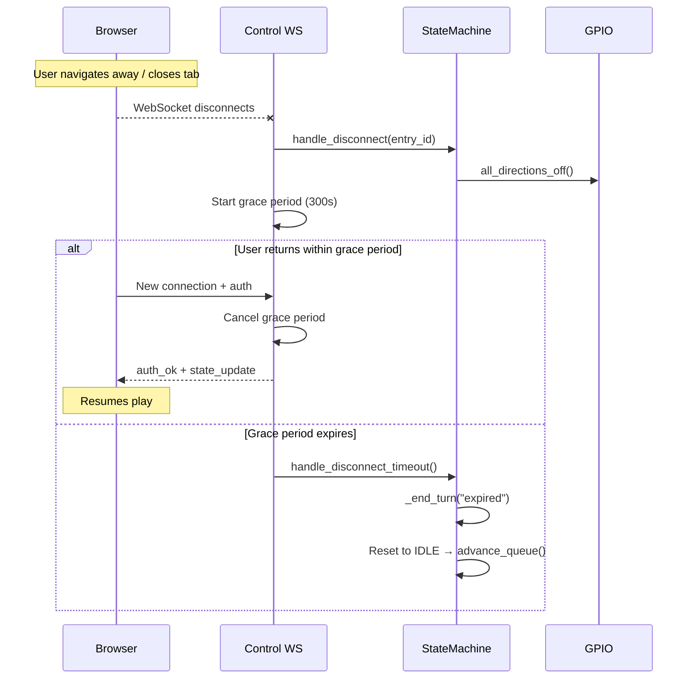
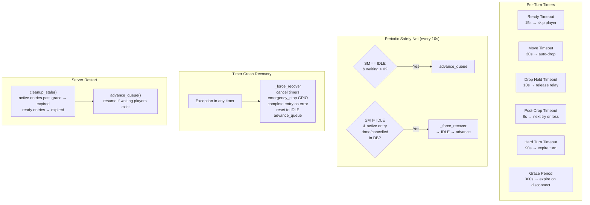
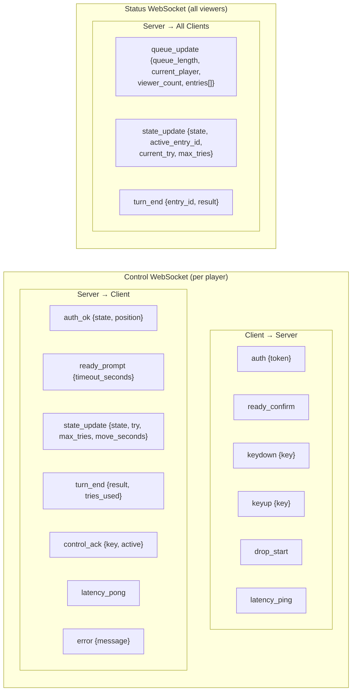

# ECLAW Queue System — Architecture & Flow

## 1. System Architecture

## 2. Queue Entry Lifecycle (DB states)

## 3. State Machine Turn Flow (TurnState)

## 4. Player Join & Turn Flow (Sequence)

## 5. Page Refresh Recovery Flow

## 6. Disconnect & Recovery Flow

## 7. Safety Nets & Recovery

## 8. WebSocket Message Types

