# ECLAW — Architecture, Flow & Protocol Reference

Complete technical documentation for the ECLAW Remote Claw Machine platform.

---

## 1. System Architecture

```mermaid
flowchart TB
    subgraph Internet["Internet Users (50+)"]
        B1[Browser 1<br/>Desktop / Mobile]
        B2[Browser 2]
        BN[Browser N]
    end

    subgraph Edge["Edge / Reverse Proxy"]
        NG[nginx<br/>TLS termination<br/>rate limiting<br/>connection limiting<br/>static file caching]
    end

    subgraph App["Application Layer"]
        API[REST API<br/>/api/queue/join<br/>/api/queue/leave<br/>/api/session/me<br/>/api/health]
        WSCtrl["/ws/control<br/>ControlHandler<br/>(per-player, authenticated)"]
        WSStatus["/ws/status<br/>StatusHub<br/>(broadcast to all viewers)"]
        SM[StateMachine<br/>TurnState FSM<br/>timers & transitions]
        QM[QueueManager<br/>CRUD on queue_entries]
        GPIO[GPIOController<br/>relay pins + win sensor]
        CAM[Camera<br/>MJPEG fallback<br/>(OpenCV)]
        WD[Watchdog<br/>independent process<br/>health monitor]
    end

    subgraph Stream["Stream Layer"]
        MTX[MediaMTX<br/>WebRTC / WHEP<br/>port 8889]
    end

    subgraph Storage["Storage"]
        DB[(SQLite + WAL<br/>queue_entries<br/>game_events)]
    end

    subgraph Hardware["Hardware (Raspberry Pi 5)"]
        Claw[Claw Machine<br/>6 relay outputs<br/>1 win sensor input]
        PiCam[Pi Camera / USB Cam]
    end

    B1 & B2 & BN -->|HTTPS + WSS| NG
    NG -->|HTTP| API
    NG -->|WS upgrade| WSCtrl
    NG -->|WS upgrade| WSStatus
    NG -->|proxy| MTX

    API --> QM
    API --> SM
    WSCtrl --> SM
    WSCtrl --> GPIO
    SM --> QM
    SM --> GPIO
    SM --> WSStatus
    SM --> WSCtrl
    QM --> DB
    GPIO --> Claw
    CAM --> PiCam
    MTX --> PiCam
    WD -.->|health check| API
    WD -.->|emergency GPIO off| GPIO
```

### Component Responsibilities

| Component | Role | Connections |
|-----------|------|-------------|
| **nginx** | TLS termination, rate limiting (10 req/s API, 3 req/min join), connection limiting (30/IP), static asset caching, WebSocket upgrade, admin IP restriction | All external traffic |
| **REST API** | Queue join/leave (supports active players via force_end_turn), session lookup, health checks, admin operations | QueueManager, StateMachine, StatusHub |
| **ControlHandler** | Authenticated per-player WebSocket channel, command rate limiting (25 Hz), reconnection grace periods, duplicate tab handling | StateMachine, GPIOController |
| **StatusHub** | Broadcast-only WebSocket hub for all viewers (up to 500), per-client send timeout (5s) | All connected browsers |
| **StateMachine** | Turn state FSM (IDLE→READY→MOVING→DROPPING→POST_DROP→TURN_END), SSOT deadline tracking (monotonic clock), timer management, DB deadline persistence, concurrent re-entry guards | QueueManager, GPIOController, StatusHub, ControlHandler |
| **QueueManager** | SQLite CRUD for queue entries, token auth, position assignment, stale cleanup, aggregate stats | Database |
| **GPIOController** | Async wrapper for gpiozero/lgpio, direction hold management, opposing direction conflict detection, pulse timing, emergency stop | Physical relay board |
| **Camera** | OpenCV USB camera capture in background thread, MJPEG encoding, auto-device detection | USB camera hardware |
| **MediaMTX** | Low-latency WebRTC streaming via WHEP protocol, supports Pi Camera Module and USB cameras via FFmpeg | Camera hardware |
| **Watchdog** | Independent process, health checks every 2s, forces GPIO off after 3 consecutive failures using direct lgpio (no gpiozero conflict) | Health API, GPIO hardware |
| **SQLite** | WAL mode for concurrent reads, busy timeout 5s, write lock serialization, periodic pruning | Persistent state |

### Single Source of Truth (SSOT) Design

ECLAW uses a layered SSOT approach to ensure consistency across all components:

| Data | Source of Truth | Synced To |
|------|----------------|-----------|
| Queue order & player state (`waiting`/`ready`/`active`/`done`) | **SQLite database** | Frontend via WebSocket `queue_update` broadcasts |
| Live game state (`TurnState`, active entry, current try) | **StateMachine in-memory** | All clients via WebSocket `state_update` broadcasts |
| Timer deadlines (move timeout, turn timeout) | **StateMachine `_state_deadline` / `_turn_deadline`** (monotonic clock) | DB columns `try_move_end_at` / `turn_end_at` (ISO 8601 UTC), clients via `state_seconds_left` / `turn_seconds_left` in payloads |
| Player authentication | **SQLite `token_hash`** | Browser `localStorage` holds raw token |
| GPIO pin states | **GPIOController** | Physical relay board |

**Key SSOT guarantees:**
- All state payloads include `state_seconds_left` and `turn_seconds_left` computed from monotonic deadlines — clients always display accurate remaining time, even after WebSocket reconnection.
- Queue broadcasts are sent on every state transition that changes queue visibility: join, leave, ready advancement, turn end, and ghost-player skip.
- The `try_move_end_at` and `turn_end_at` DB columns are populated when entering MOVING state, providing a persistent recovery baseline if the server restarts.

---

## 2. Queue Entry Lifecycle (Database States)

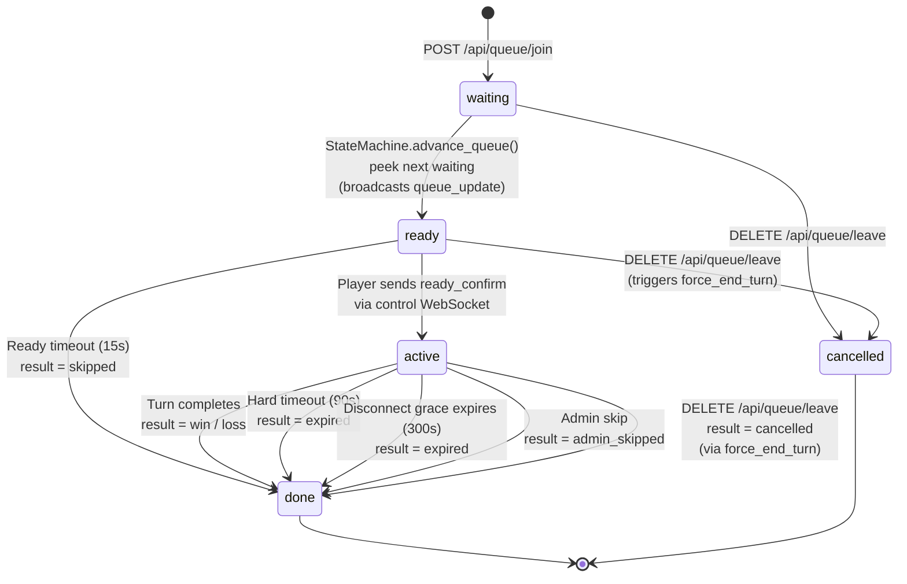

### State Descriptions

| State | Meaning | Duration | Exit Conditions |
|-------|---------|----------|-----------------|
| `waiting` | Player is in queue, waiting for their turn | Until advanced or cancelled | advance_queue() → ready, leave → cancelled |
| `ready` | Player is next; must confirm readiness | Up to 15s (configurable) | ready_confirm → active, timeout → done(skipped), leave → cancelled |
| `active` | Player is controlling the claw | Up to 90s hard limit | Turn ends with win/loss/expired/admin_skipped/cancelled |
| `done` | Turn completed (terminal) | Retained for 48h then pruned | N/A |
| `cancelled` | Player left voluntarily (terminal) | Retained for 48h then pruned | N/A |

### Result Values

| Result | Meaning |
|--------|---------|
| `win` | Win sensor triggered during POST_DROP or DROPPING |
| `loss` | All tries exhausted, no win detected |
| `skipped` | Player didn't confirm ready within timeout |
| `expired` | Hard turn timeout or disconnect grace period expired |
| `admin_skipped` | Operator force-ended the turn |
| `cancelled` | Player voluntarily left the queue |
| `error` | State machine crash recovery (rare) |

---

## 3. State Machine Turn Flow (TurnState)

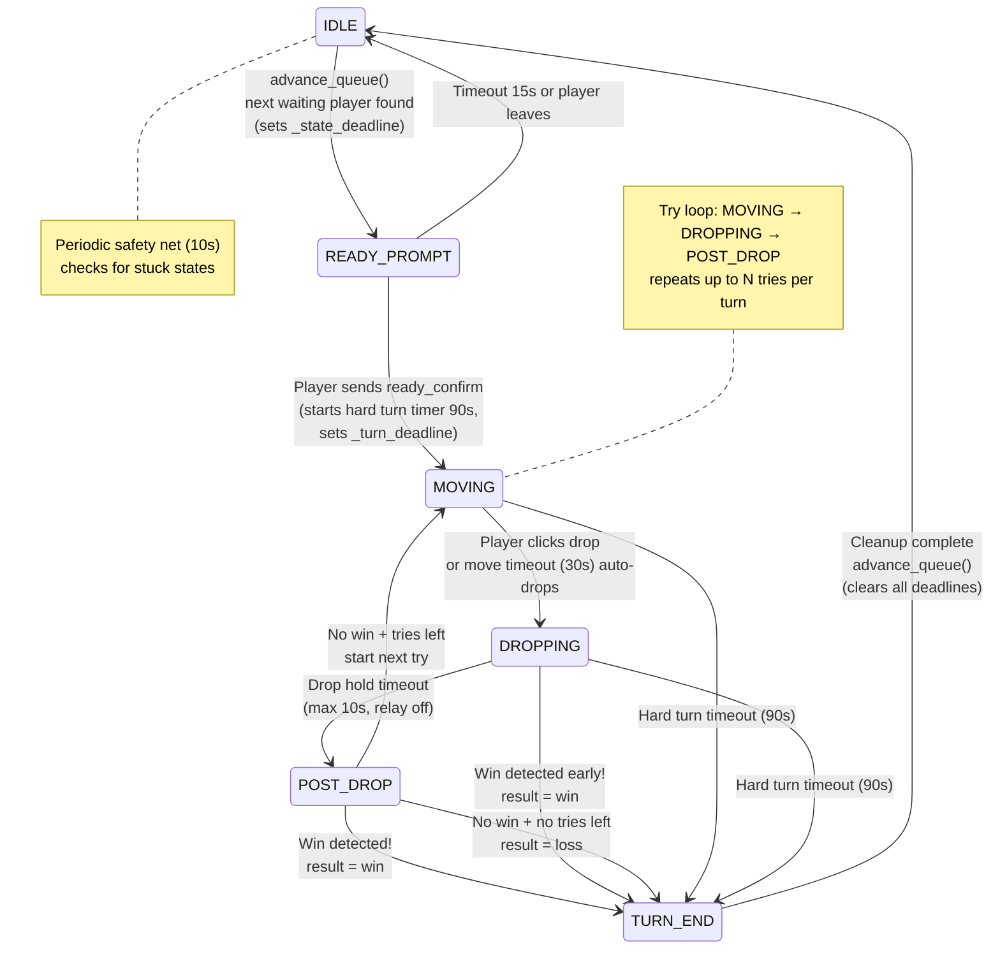

### TurnState Descriptions

| State | GPIO Activity | Timers Active | Deadline Tracking | Player Can |
|-------|--------------|---------------|-------------------|------------|
| `IDLE` | All OFF | None | `_state_deadline = 0`, `_turn_deadline = 0` | Nothing (not their turn) |
| `READY_PROMPT` | All OFF | Ready timeout (15s) | `_state_deadline` set | Confirm ready, leave queue |
| `MOVING` | Directions ON/OFF per input | Move timeout (30s), hard turn (90s) | `_state_deadline` set, DB `try_move_end_at` + `turn_end_at` written | Move claw (WASD/touch), press drop, leave queue |
| `DROPPING` | Drop relay ON, directions OFF | Drop hold (10s), hard turn (90s) | `_state_deadline` set | Nothing (automatic), leave queue |
| `POST_DROP` | All OFF, win sensor active | Post-drop wait (8s), hard turn (90s) | `_state_deadline` set | Nothing (watching for win) |
| `TURN_END` | Emergency stop (all OFF) | None | Cleared | Nothing (cleanup in progress) |

### Timer Summary

| Timer | Duration | Starts When | Action on Expiry | SSOT |
|-------|----------|------------|-----------------|------|
| Ready timeout | 15s | READY_PROMPT entered | Skip player, advance queue | `_state_deadline` (monotonic) |
| Move timeout | 30s | MOVING entered (per try) | Auto-drop | `_state_deadline` + DB `try_move_end_at` (UTC ISO 8601) |
| Drop hold timeout | 10s | DROPPING entered | Release drop relay, enter POST_DROP | `_state_deadline` |
| Post-drop wait | 8s | POST_DROP entered | Check tries left: next try or loss | `_state_deadline` |
| Hard turn timeout | 90s | Player confirms ready | Force expire turn | `_turn_deadline` + DB `turn_end_at` (UTC ISO 8601) |
| Grace period | 300s | Active player disconnects | Expire turn if not reconnected | ControlHandler in-memory |

---

## 4. Player Join & Turn Flow (Full Sequence)

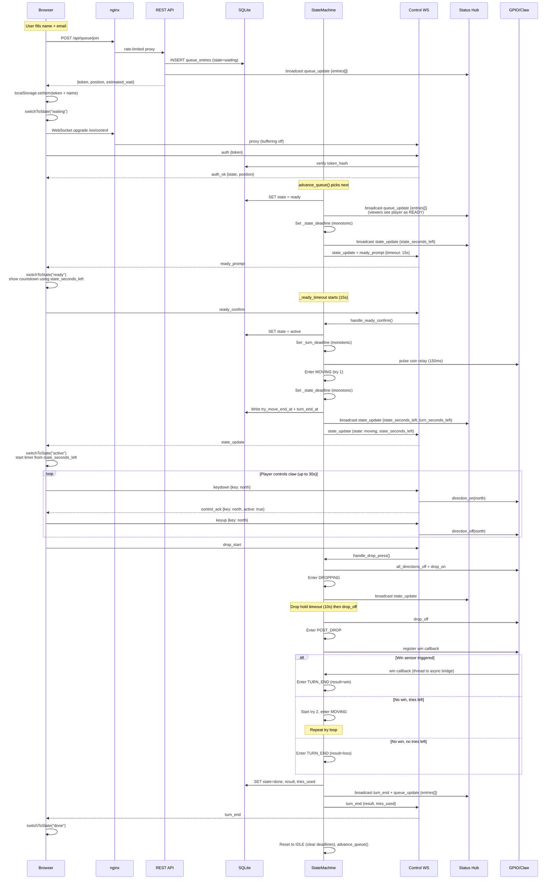

---

## 5. Page Refresh & Reconnection Flow

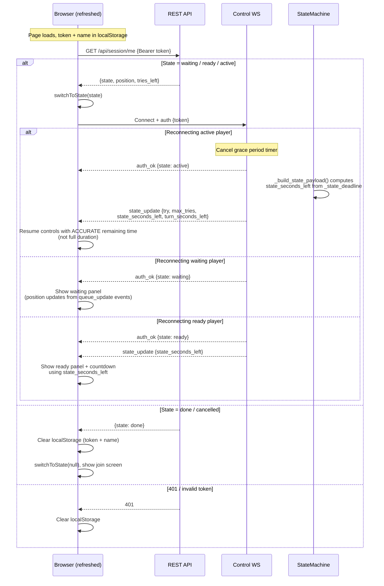

### SSOT Timer Sync on Reconnect

When a player reconnects (page refresh or network recovery), the server sends a `state_update` containing:

| Field | Source | Purpose |
|-------|--------|---------|
| `state_seconds_left` | `max(0, _state_deadline - time.monotonic())` | Remaining time for current state timer (ready/move/drop/post-drop) |
| `turn_seconds_left` | `max(0, _turn_deadline - time.monotonic())` | Remaining time for hard turn timeout |
| `try_move_seconds` | Settings value | Full duration (used only if `state_seconds_left` is 0) |

The frontend prefers `state_seconds_left` over `try_move_seconds` when starting timers, ensuring the displayed countdown matches the server's actual deadline.

---

## 6. Disconnect & Recovery Flow

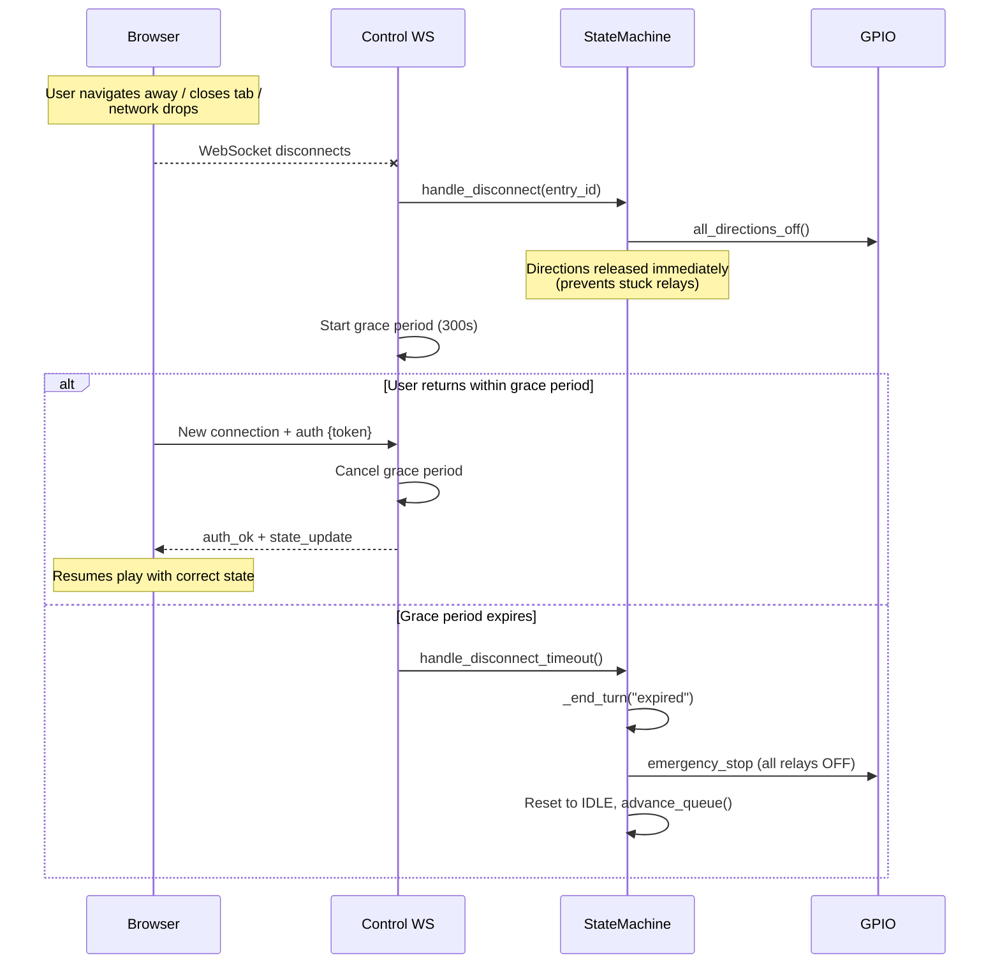

---

## 7. Safety Nets & Recovery Architecture

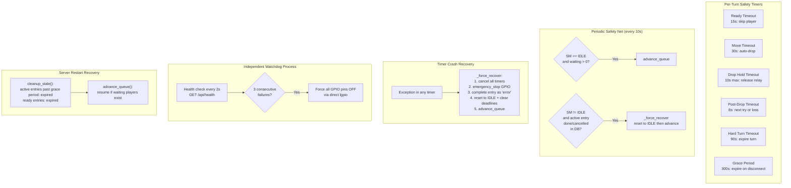

### Safety Layer Summary

| Layer | Scope | Failure Mode Covered |
|-------|-------|---------------------|
| Ghost player skip | advance_queue | Player navigated away > 30s ago with no WebSocket: skipped instantly |
| State machine timers | Per-turn | Player idle, relay stuck on, turn running forever |
| SSOT deadline tracking | Per-turn | Timer display drift on reconnect — clients receive `state_seconds_left` from monotonic clock |
| DB deadline persistence | Per-turn | `try_move_end_at` and `turn_end_at` written to DB for crash recovery reference |
| Queue broadcast on ready | advance_queue | Viewers see stale queue list — now broadcast `queue_update` when player advances to READY |
| Active player leave | DELETE /queue/leave | Active players can now leave via `force_end_turn` instead of getting 404 |
| Re-entry guard | _end_turn | Two timers firing simultaneously (e.g., hard timeout + post-drop) |
| Periodic queue check | Global (10s) | SM stuck in IDLE with waiting players, stale active_entry_id, or active entry externally cancelled |
| _force_recover | Timer crash | Unhandled exception in any timer coroutine — clears deadlines and resets to IDLE |
| Grace period | Disconnect | Active player loses network/closes tab |
| Watchdog process | System-wide | Game server crash, hang, or OOM |
| Startup cleanup | Server restart | Stale entries from previous session |
| nginx rate limiting | Network edge | Request flooding, connection exhaustion |
| nginx connection limit | Network edge | Single IP opening too many connections |
| GPIO emergency stop | Admin/watchdog | Physical safety: all relays OFF immediately |

---

## 8. WebSocket Message Reference

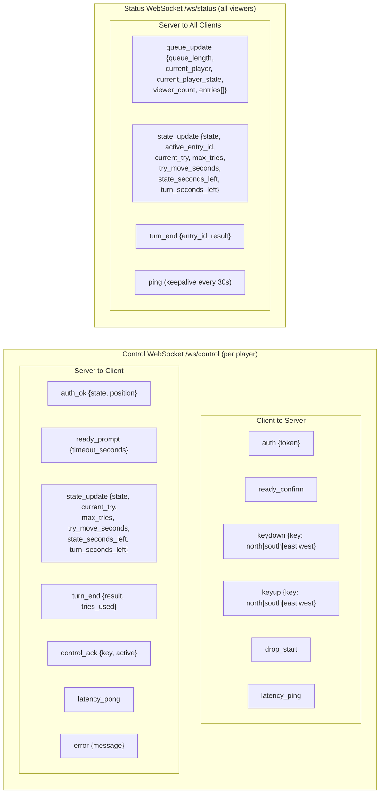

### Control WebSocket Protocol

**Connection lifecycle:**
1. Client opens WebSocket to `/ws/control`
2. Client sends `auth` message within 10s (or gets disconnected)
3. Server validates token hash against database
4. Server responds with `auth_ok` (or `error` + close)
5. If player is active, server also sends current `state_update`
6. Client enters message loop until disconnect

**Rate limiting:**
- `keydown` events: max 25 Hz (40ms minimum interval)
- `keyup`, `drop_start`, `ready_confirm`: no rate limit (always pass through)
- `latency_ping`: no rate limit (bypass)
- Message size limit: 1024 bytes

**Reconnection (SSOT timer sync):**
- Client auto-reconnects with exponential backoff (1s to 10s max)
- Server cancels grace period on successful re-auth
- Server sends `state_update` with `state_seconds_left` and `turn_seconds_left` computed from monotonic deadlines
- Client starts timers from `state_seconds_left` (not from full duration), ensuring accurate countdown display after reconnect

### Status WebSocket Protocol

**Connection lifecycle:**
1. Client opens WebSocket to `/ws/status`
2. Server accepts (up to 500 viewers max)
3. Server broadcasts state updates to all connected viewers
4. Server sends keepalive pings every 30s
5. Per-client send timeout of 5s prevents slow clients from blocking others

**No authentication required** — anyone can view the queue and game state.

---

## 9. REST API Reference

### Public Endpoints

| Method | Path | Auth | Rate Limit | Request | Response |
|--------|------|------|-----------|---------|----------|
| POST | `/api/queue/join` | None | 3/min (nginx), 15/hr per email, 30/hr per IP | `{name, email}` | `{token, position, estimated_wait_seconds}` |
| DELETE | `/api/queue/leave` | Bearer token | 10/s | Header: `Authorization: Bearer <token>` | `{ok: true}` (works for waiting, ready, AND active players) |
| GET | `/api/queue/status` | None | 10/s | -- | `{current_player, current_player_state, queue_length}` |
| GET | `/api/queue` | None | 10/s | -- | `{entries[], total, current_player, game_state}` |
| GET | `/api/session/me` | Bearer token | 10/s | Header: `Authorization: Bearer <token>` | `{state, position, tries_left, current_try}` |
| GET | `/api/history` | None | 10/s | -- | `{entries[{name, result, tries_used, completed_at}]}` |
| GET | `/api/health` | None | 10/s | -- | `{status, game_state, gpio_locked, camera_ok, queue_length, viewer_count, uptime_seconds}` |

### Camera Streaming Endpoints

| Method | Path | Auth | Response |
|--------|------|------|----------|
| GET | `/api/stream/snapshot` | None | Single JPEG frame |
| GET | `/api/stream/mjpeg` | None | Continuous MJPEG stream (max 20 concurrent) |

### Admin Endpoints (require `X-Admin-Key` header, IP-restricted to private networks in nginx)

| Method | Path | Response |
|--------|------|----------|
| POST | `/admin/advance` | Force-end current player's turn |
| POST | `/admin/emergency-stop` | Lock all GPIO immediately |
| POST | `/admin/unlock` | Unlock GPIO after emergency stop |
| POST | `/admin/pause` | Pause queue advancement |
| POST | `/admin/resume` | Resume queue advancement |
| GET | `/admin/dashboard` | Full status dashboard (JSON) |

---

## 10. Database Schema

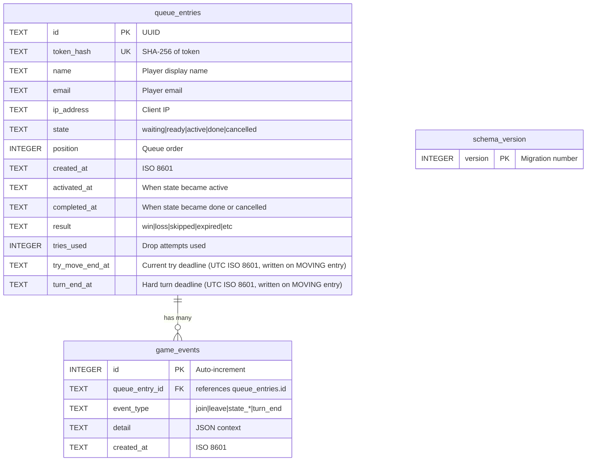

### Indexes

| Index | Table | Columns | Notes |
|-------|-------|---------|-------|
| `idx_queue_state` | queue_entries | state | Fast state-based lookups |
| `idx_queue_position` | queue_entries | position | Partial: active/ready/waiting only |
| `idx_events_entry` | game_events | queue_entry_id | Event lookups by player |
| `idx_events_time` | game_events | created_at | Time-range queries for pruning |

### Database Configuration

| PRAGMA | Value | Purpose |
|--------|-------|---------|
| `journal_mode` | WAL | Allows concurrent reads during writes |
| `foreign_keys` | ON | Enforce referential integrity |
| `busy_timeout` | 5000ms | Wait instead of failing on lock contention |
| `synchronous` | NORMAL | Balance durability vs. performance |

---

## 11. Authentication & Security

### Player Authentication Flow

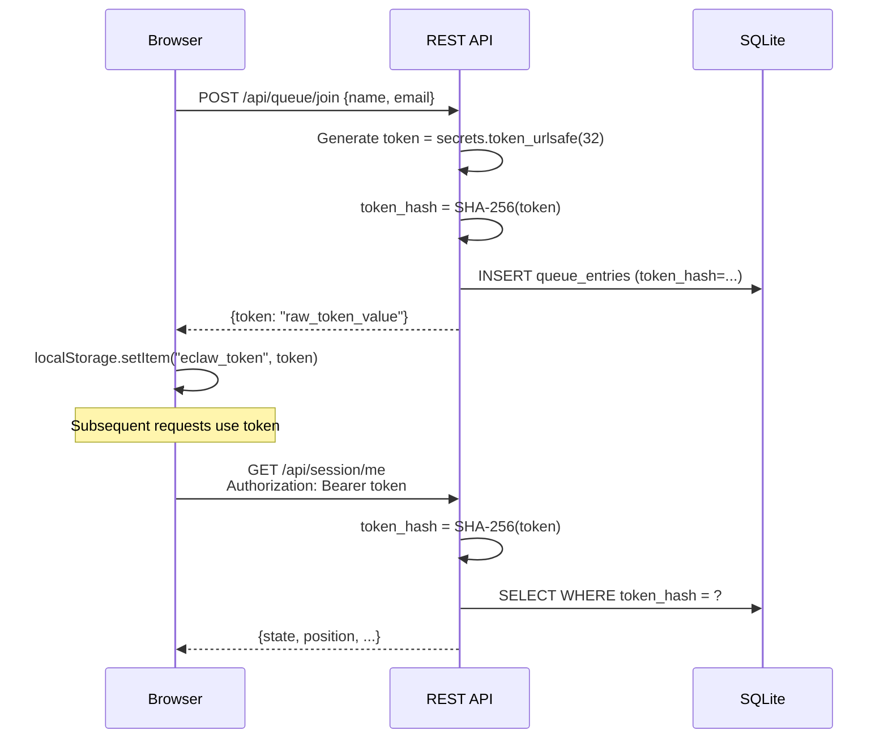

### Security Measures

| Measure | Implementation | Protects Against |
|---------|---------------|-----------------|
| Token hashing | SHA-256 stored, plaintext never in DB | Database breach exposing valid tokens |
| Constant-time comparison | `hmac.compare_digest` for admin key | Timing attacks on admin auth |
| XSS prevention | Server strips `<>&"'` from names; client uses `escapeHtml()` | Stored XSS in queue/history lists |
| CORS | Configurable allowed origins | Cross-origin API abuse |
| Rate limiting (nginx) | 10 req/s API, 3 req/min join | Request flooding |
| Rate limiting (app) | 15/hr per email, 30/hr per IP for join | Queue spam |
| Connection limiting | 30 conn/IP (nginx), 500 status viewers, 100 control WS | Connection exhaustion |
| Admin IP restriction | nginx `allow` only RFC 1918 + localhost | Admin endpoint exposure on internet |
| TLS 1.2+ | nginx ssl_protocols | Downgrade attacks |
| Security headers | HSTS, X-Frame-Options, CSP, etc. | Clickjacking, MIME sniffing, etc. |
| Message size limit | 1024 bytes per WebSocket message | Buffer overflow, memory exhaustion |
| Broadcast send timeout | 5s per viewer in StatusHub | One slow client blocking all broadcasts |

---

## 12. Scaling for 50+ Internet Users

### What Scales

| Resource | Limit | Bottleneck | Notes |
|----------|-------|-----------|-------|
| Status viewers (WebSocket) | 500 | Memory (~1KB/conn) | Broadcast with per-client timeout |
| Control WebSocket connections | 100 | Auth + memory | Only queued/active players need one |
| Queue depth | Unlimited | SQLite write throughput | WAL mode handles concurrent reads |
| nginx connections per IP | 30 | Configuration | Prevents one client hogging workers |
| MJPEG streams | 20 | CPU (JPEG encoding) | WebRTC/MediaMTX is the primary path |
| API requests | 10/s per IP | nginx rate limit | Burst of 20 allowed |
| Queue join | 3/min per IP | nginx rate limit | Plus 15/hr per email, 30/hr per IP in app |

### Design Constraints (by design, not bugs)

| Constraint | Reason | Mitigation |
|-----------|--------|-----------|
| Single claw machine | Physical hardware | Only one active player at a time |
| SQLite (single file) | Simplicity, Pi deployment | WAL mode + write lock; sufficient for single-machine use |
| In-memory rate limiting | Single process, no Redis | nginx handles the edge; app rate limits are per-email/IP backup |
| Single uvicorn worker | GPIO ownership, shared state | Async handles concurrency within one process |

### Deployment Recommendations for 50+ Users

1. **Use WebRTC via MediaMTX** (not MJPEG) for the video stream -- one WebRTC connection per viewer is far more efficient than MJPEG
2. **Set CORS_ALLOWED_ORIGINS** to your exact domain -- not `*`
3. **Change ADMIN_API_KEY** from the default `changeme`
4. **Enable nginx** with the provided config -- it handles rate limiting, TLS, and connection limits
5. **Consider Cloudflare** or similar CDN/WAF for DDoS protection if fully public
6. **Monitor with the admin dashboard**: `GET /admin/dashboard`
7. **Watch logs**: `sudo journalctl -u claw-server -f`

---

## 13. Configuration Reference

### Environment Variables (`.env`)

#### Timing
| Variable | Default | Description |
|----------|---------|-------------|
| `TRIES_PER_PLAYER` | 2 | Drop attempts per turn |
| `TURN_TIME_SECONDS` | 90 | Hard limit for entire turn |
| `TRY_MOVE_SECONDS` | 30 | Time to move before auto-drop |
| `POST_DROP_WAIT_SECONDS` | 8 | Wait after drop for win sensor |
| `READY_PROMPT_SECONDS` | 15 | Time to confirm readiness |
| `QUEUE_GRACE_PERIOD_SECONDS` | 300 | Disconnect reconnection window |

#### GPIO
| Variable | Default | Description |
|----------|---------|-------------|
| `PIN_COIN` | 17 | Coin relay (BCM) |
| `PIN_NORTH` | 27 | North direction relay |
| `PIN_SOUTH` | 5 | South direction relay |
| `PIN_WEST` | 6 | West direction relay |
| `PIN_EAST` | 24 | East direction relay |
| `PIN_DROP` | 25 | Drop mechanism relay |
| `PIN_WIN` | 16 | Win sensor input |
| `RELAY_ACTIVE_LOW` | true | Active-low for SainSmart boards |
| `COIN_PULSE_MS` | 150 | Coin pulse duration |
| `DROP_PULSE_MS` | 200 | Drop pulse duration |
| `DROP_HOLD_MAX_MS` | 10000 | Max drop hold time |
| `MIN_INTER_PULSE_MS` | 500 | Min interval between pulses |
| `DIRECTION_HOLD_MAX_MS` | 30000 | Max direction hold |
| `COIN_EACH_TRY` | true | Pulse coin before each try |

#### Control
| Variable | Default | Description |
|----------|---------|-------------|
| `COMMAND_RATE_LIMIT_HZ` | 25 | Max keydown commands/sec |
| `DIRECTION_CONFLICT_MODE` | ignore_new | How to handle opposing directions |

#### Server
| Variable | Default | Description |
|----------|---------|-------------|
| `HOST` | 0.0.0.0 | Bind address |
| `PORT` | 8000 | API port |
| `DATABASE_PATH` | ./data/claw.db | SQLite file path |
| `ADMIN_API_KEY` | changeme | **Change in production** |
| `CORS_ALLOWED_ORIGINS` | http://localhost,http://127.0.0.1 | Comma-separated allowed origins |
| `MOCK_GPIO` | false | Use mock GPIO (true for dev) |
| `DB_RETENTION_HOURS` | 48 | Auto-prune completed entries |

#### Stream
| Variable | Default | Description |
|----------|---------|-------------|
| `MEDIAMTX_HEALTH_URL` | http://127.0.0.1:8889/v3/paths/list | MediaMTX health endpoint |
| `CAMERA_DEVICE` | 0 | /dev/videoN index for MJPEG fallback |

#### Watchdog
| Variable | Default | Description |
|----------|---------|-------------|
| `WATCHDOG_HEALTH_URL` | http://127.0.0.1:8000/api/health | Health check endpoint |
| `WATCHDOG_CHECK_INTERVAL_S` | 2 | Check frequency |
| `WATCHDOG_FAIL_THRESHOLD` | 3 | Failures before force-off |

---

## 14. Hardware Wiring Diagram

### Pin Map (BCM Numbering)

| Function | BCM Pin | Physical Pin | Relay Input | Type |
|----------|---------|-------------|-------------|------|
| Coin | 17 | 11 | IN1 | Pulse output (150ms) |
| North | 27 | 13 | IN2 | Hold output (direction) |
| South | 5 | 29 | IN3 | Hold output (direction) |
| West | 6 | 31 | IN4 | Hold output (direction) |
| East | 24 | 18 | IN5 | Hold output (direction) |
| Drop | 25 | 22 | IN6 | Hold output (auto-release) |
| Win | 16 | 36 | -- | Digital input (pull-up, active LOW) |

### Wiring Diagram

```
Raspberry Pi 5                    SainSmart 8-Channel Relay Board
+--------------+                  +-------------------------------+
|              |                  |                               |
|  5V (pin 2)  |---------------->| VCC                           |
|  GND (pin 6) |---------------->| GND                           |
|              |                  |                               |
|  BCM 17      |---------------->| IN1 (Coin)    COM--+          |
|  BCM 27      |---------------->| IN2 (North)   COM--| Wire to  |
|  BCM 5       |---------------->| IN3 (South)   COM--| claw     |
|  BCM 6       |---------------->| IN4 (West)    COM--| machine  |
|  BCM 24      |---------------->| IN5 (East)    COM--| buttons  |
|  BCM 25      |---------------->| IN6 (Drop)    COM--+ (NO+COM) |
|              |                  | IN7 (unused)                  |
|  BCM 16      |<-- Win sensor -- | IN8 (unused)                  |
|              |                  |                               |
+--------------+                  |  [JD-VCC <-> VCC jumper]      |
                                  +-------------------------------+
```

---

## 15. Deployment Architecture

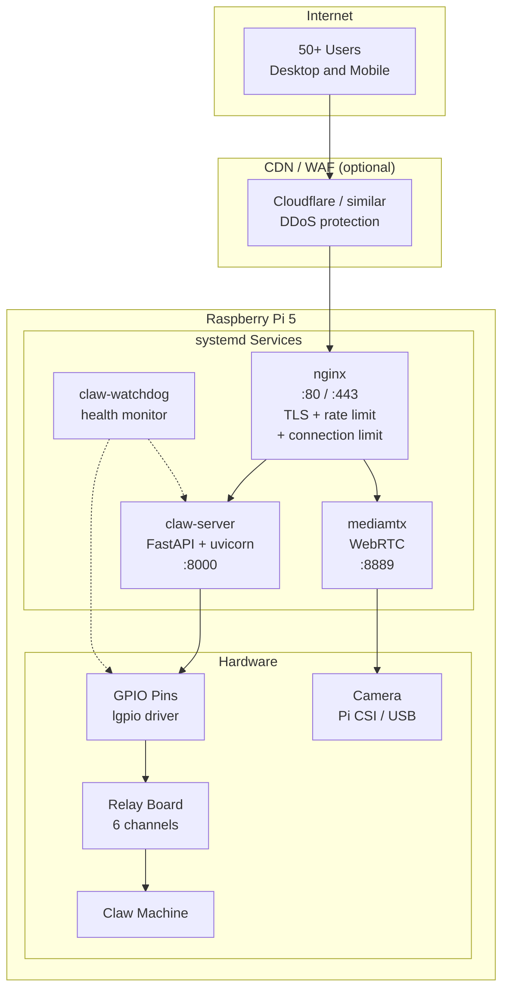

### Process Model

| Process | User | Groups | Restart Policy | Dependencies |
|---------|------|--------|---------------|-------------|
| `claw-server` | claw | gpio, video | always (3s delay) | mediamtx |
| `claw-watchdog` | claw | gpio | always (1s delay) | none (independent) |
| `mediamtx` | mediamtx | video | always | none |
| `nginx` | www-data | -- | always | none |

---

## 16. Frontend Architecture

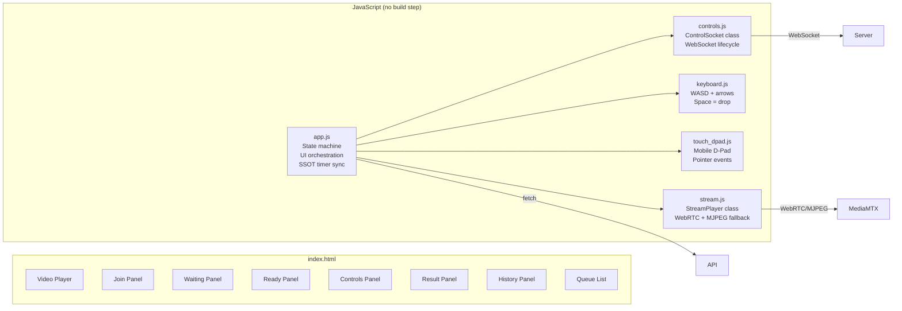

### UI State Machine

```
null (join screen) --> waiting --> ready --> active --> done
      ^                  |                              |
      +------------------+------------- cleanup <-------+
```

| UI State | Panel Shown | Inputs Active | WebSocket | SSOT Sync |
|----------|------------|---------------|-----------|-----------|
| `null` | Join form | Name + email | Status only | -- |
| `waiting` | Queue position + leave button | Leave button | Status + Control | Position updates from `queue_update` events |
| `ready` | Ready button + countdown | Ready button | Status + Control | Timer from `state_seconds_left` (accurate on reconnect) |
| `active` | Video + D-pad/keyboard + timer | WASD/touch + drop + leave | Status + Control | Move timer from `state_seconds_left` (accurate on reconnect) |
| `done` | Result + play-again button | Play again | Status only | -- |

### Reconnection Behavior

| Component | Strategy | Backoff |
|-----------|----------|---------|
| Status WebSocket | Auto-reconnect on close | 3s to 30s (x1.5) |
| Control WebSocket | Auto-reconnect on close | 1s to 10s (x2) |
| WebRTC stream | Reconnect on ICE failure | 3s fixed, 10s for transient disconnect |
| MJPEG fallback | Reconnect on img error | 3s fixed |
