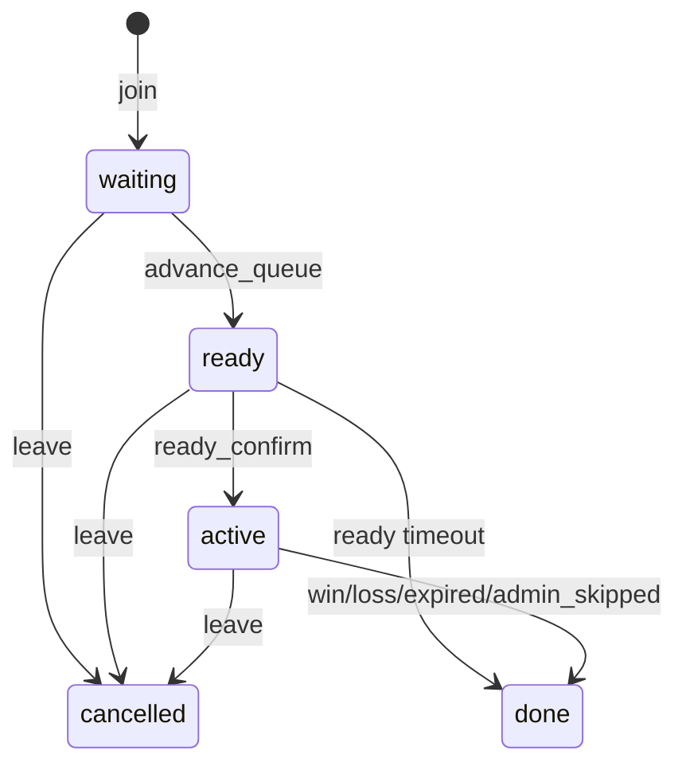
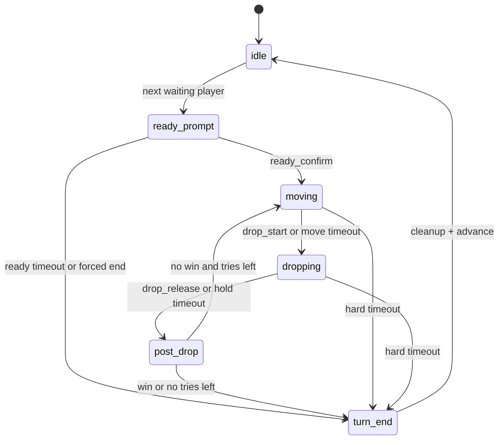
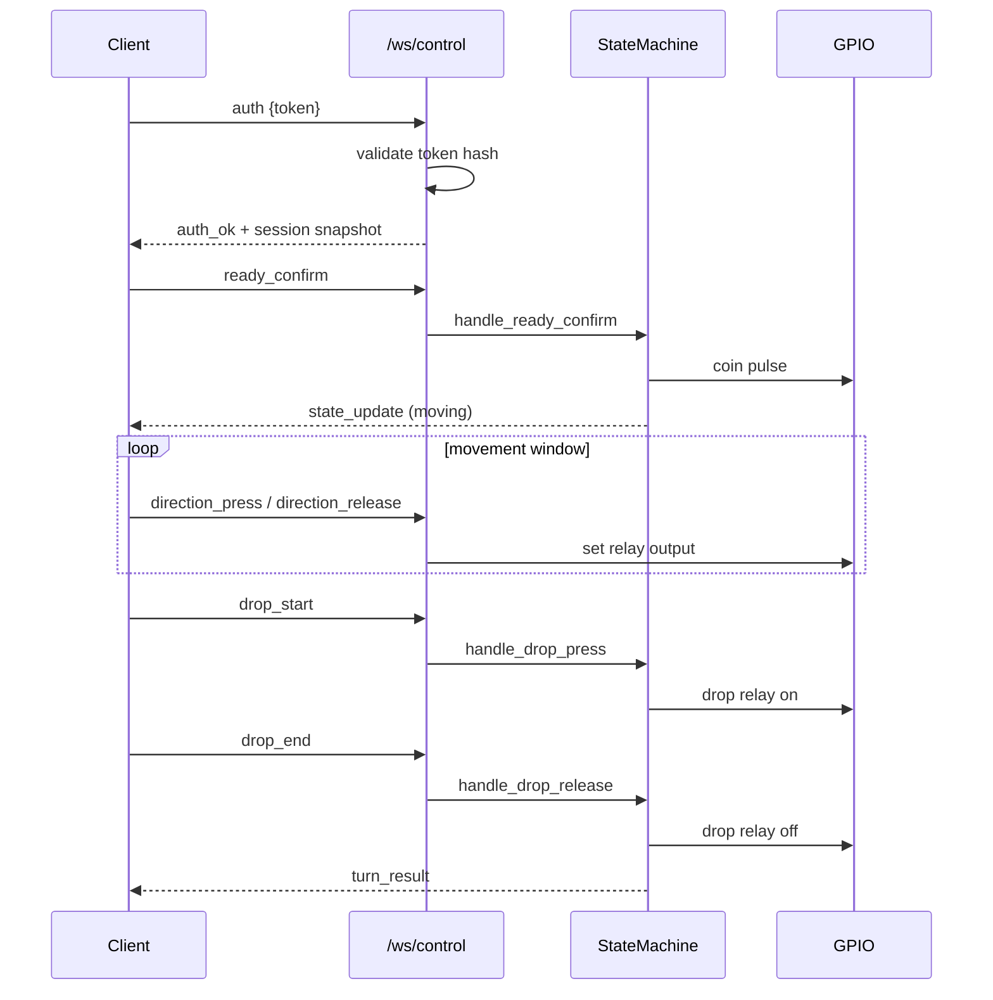

# Queue, State, and Protocol Reference

This document describes the current queue lifecycle, state machine transitions, WebSocket protocol, and persistence boundaries.

## 1. System Components

```mermaid
flowchart TB
    UI[Web UI / Embed UI] --> API[FastAPI]
    UI --> WSStatus[/ws/status]
    UI --> WSControl[/ws/control]

    API --> QM[QueueManager]
    API --> SM[StateMachine]
    WSControl --> SM
    WSControl --> GPIO[GPIOController]
    SM --> GPIO
    SM --> Hub[StatusHub]
    SM --> QM

    QM --> DB[(SQLite)]
    API --> DB

    API --> StreamProxy[/stream/* proxy]
    StreamProxy --> MTX[MediaMTX]
    API --> MJPEG[/api/stream/mjpeg]

    GPIO --> Hardware[Relays + win sensor]
```

## 2. Source of Truth

| Domain | Authority | Notes |
|---|---|---|
| Queue entries and final outcomes | SQLite (`queue_entries`) | Durable and queryable by API/admin endpoints |
| Runtime turn state (`idle`, `ready_prompt`, etc.) | `StateMachine` in memory | Broadcast through status and control channels |
| Active deadlines for UI countdowns | `StateMachine` monotonic deadlines | Remaining seconds derived from monotonic timers |
| Authentication tokens | SQLite token hash | Client keeps raw token locally |
| Relay output state | `GPIOController` | Emergency stop can override all motion |

## 3. Queue Lifecycle



### Result values used in persistence

- `win`
- `loss`
- `skipped`
- `expired`
- `admin_skipped`
- `cancelled`
- `error`

## 4. Turn State Machine



## 5. Control Channel Sequence



## 6. Broadcast Channel (`/ws/status`)

`/ws/status` broadcasts queue and state snapshots to all viewers.

Common message families:
- `state_update`
- `queue_update`
- `turn_end`
- keepalive ping frames

Operational constraints:
- Max viewers from config (`max_status_viewers`).
- Per-client send timeout (`status_send_timeout_s`) prevents one slow socket from blocking global broadcasts.

## 7. Timeouts and Recovery

| Mechanism | Trigger | Effect |
|---|---|---|
| Ready timeout | no `ready_confirm` | entry completed as `skipped` |
| Move timeout | no drop action during moving window | auto transition to dropping |
| Hard turn timeout | turn exceeds configured cap | result `expired` |
| Disconnect handling | active control socket disconnects | directions forced off immediately |
| Disconnect grace timeout | player fails to reconnect in grace window | result `expired` |
| Periodic queue safety check | inconsistent or stuck state | force recovery and resume queue |

## 8. Persistence and Database Notes

- SQLite runs in WAL mode through project database initialization.
- Rate limits are persisted in `rate_limits` and pruned periodically.
- Queue retention is bounded by `db_retention_hours` for completed entries.
- Deadlines (`try_move_end_at`, `turn_end_at`) are written on moving-state entry for recovery context.

## 9. Streaming Paths

- `/stream/*` routes are proxied by FastAPI to MediaMTX when running without nginx.
- `/api/stream/mjpeg` and `/api/stream/snapshot` provide OpenCV-backed fallback.
- MJPEG stream concurrency is bounded by `max_mjpeg_streams`.

## 10. Operational Commands

```bash
make test
make simulate
make status
./scripts/health_check.sh http://localhost:8000
```
